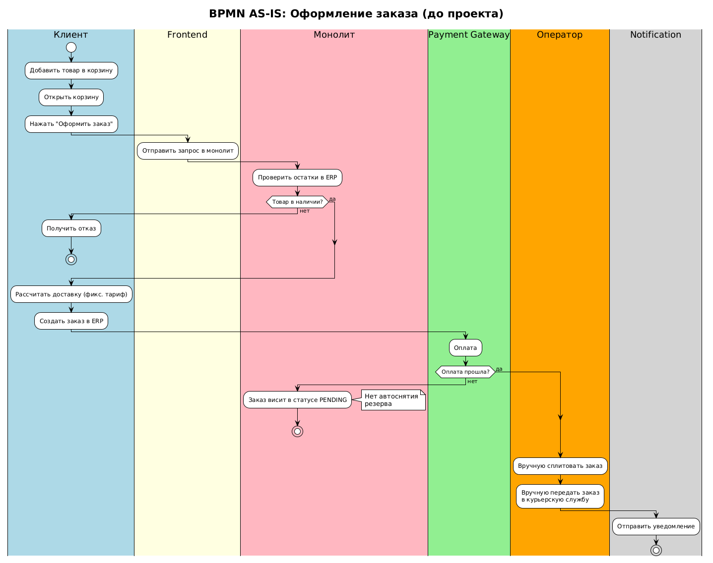
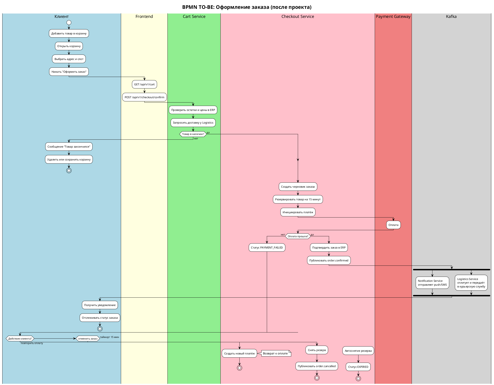

# 6. Бизнес-процессы (BPMN): AS-IS и TO-BE

## 6.1. Назначение документа

Раздел описывает процесс оформления заказа в двух состояниях:
- **AS-IS** — как процесс работал до проекта (проблемы, ручные операции, узкие места).
- **TO-BE** — как процесс будет работать после внедрения (автоматизация, асинхронные интеграции, отказоустойчивость).

Для каждого процесса приведены:
- Текстовое описание шагов.
- BPMN-диаграмма (PlantUML).
- Список участников (пулов и дорожек).
- Проблемы AS-IS и решения TO-BE.

**Инструмент моделирования:** PlantUML (BPMN-нотация).
**Стандарт:** BPMN 2.0.

---

## 6.2. Участники процесса (пулы и дорожки)

| Пул / Дорожка | Роль |
|---------------|------|
| **Клиент** | Пользователь мобильного приложения или сайта |
| **Frontend** | Мобильное приложение / веб-сайт |
| **Cart Service** | Микросервис корзины |
| **Checkout Service** | Микросервис оформления заказа |
| **Logistics Service** | Микросервис расчёта доставки |
| **Payment Gateway** | Внешний платёжный шлюз |
| **ERP System** | Система учёта остатков и заказов |
| **WMS** | Система управления складом |
| **Notification Service** | Сервис push/SMS/email-уведомлений |
| **Kafka** | Брокер сообщений |
| **Оператор клиентского сервиса** | Ручной разбор инцидентов |

---

## 6.3. Процесс AS-IS: оформление заказа до проекта

### 6.3.1. Описание процесса AS-IS

Процесс оформления заказа до проекта был **синхронным и ручным** на ключевых этапах. Основные проблемы:
- Проверка остатков происходила **после** оформления заказа, а не на этапе корзины.
- Стоимость доставки была **фиксированной**, без учёта габаритов и геолокации.
- Сплитование заказов выполнялось **вручную** оператором.
- Все интеграции были **синхронными**, что вызывало таймауты в пиковые нагрузки.
- Отсутствовало резервирование товара.
- Не было идемпотентности — повторное нажатие «Оплатить» создавало дубли.

### 6.3.2. Шаги процесса AS-IS

| Шаг | Действие | Ответственный | Проблема |
|-----|----------|---------------|----------|
| 1 | Клиент добавляет товар в корзину | Клиент | — |
| 2 | Клиент открывает корзину | Frontend | Нет проверки остатков |
| 3 | Клиент нажимает «Оформить заказ» | Клиент | — |
| 4 | Frontend отправляет запрос в монолит | Frontend | Синхронный вызов |
| 5 | Монолит проверяет остатки в ERP | ERP | Таймаут при нагрузке |
| 6 | Если товара нет — заказ отклоняется | ERP | Плохой UX |
| 7 | Монолит рассчитывает доставку по фиксированному тарифу | Монолит | Неточная стоимость |
| 8 | Создаётся заказ в ERP | ERP | — |
| 9 | Клиент оплачивает через платёжный шлюз | Payment Gateway | Нет идемпотентности |
| 10 | Если оплата не прошла — заказ висит | — | Нет автоматического снятия |
| 11 | Оператор вручную сплитует заказ | Оператор | Высокая нагрузка, ошибки |
| 12 | Оператор вручную передаёт заказ в курьерскую службу | Оператор | Задержки |
| 13 | Клиент получает уведомление | Notification | Не всегда |

### 6.3.3. BPMN-диаграмма AS-IS

Исходник диаграммы: [bpmn-as-is.puml](../diagrams/bpmn-as-is.puml)

### 6.3.4. Ключевые проблемы AS-IS

| № | Проблема | Влияние |
|---|----------|---------|
| 1 | Проверка остатков только на этапе оформления | Высокая доля отмен |
| 2 | Фиксированная стоимость доставки | Отказы от крупногабарита |
| 3 | Ручное сплитование заказов | Ошибки, задержки, нагрузка на операторов |
| 4 | Синхронные вызовы ERP | Таймауты в пик |
| 5 | Нет идемпотентности | Дубли заказов |
| 6 | Нет резервирования товара | Товар уходит другому клиенту |
| 7 | Нет автоматического снятия резерва | «Зависшие» заказы |
| 8 | Ручная передача в курьерскую службу | Задержки доставки |

## 6.4. Процесс TO-BE: оформление заказа после проекта

### 6.4.1. Описание процесса TO-BE

Процесс TO-BE строится на принципах:

- **Ранняя валидация** — остатки и цены проверяются уже в корзине.
- **Динамический расчёт доставки** — на основе адреса, габаритов и загрузки.
- **Автоматическое сплитование** — без участия оператора.
- **Асинхронные интеграции** — через Kafka, устойчивы к сбоям.
- **Резервирование товара** — на 15 минут при переходе к оплате.
- **Идемпотентность** — защита от дублей.
- **Автоматические уведомления** — на каждом этапе.

### 6.4.2. Шаги процесса TO-BE

| Шаг | Действие | Ответственный |
|-----|----------|---------------|
| 1 | Клиент добавляет товар в корзину | Клиент |
| 2 | Клиент открывает корзину | Frontend |
| 3 | Cart Service проверяет остатки и цены в ERP | Cart Service |
| 4 | Cart Service запрашивает доставку у Logistics Service | Cart Service |
| 5 | Logistics Service возвращает слоты и стоимость | Logistics Service |
| 6 | Клиент выбирает адрес и слот | Клиент |
| 7 | Клиент нажимает «Оформить заказ» | Клиент |
| 8 | Checkout Service создаёт черновик заказа | Checkout Service |
| 9 | Checkout Service резервирует товар на 15 минут | Checkout Service |
| 10 | Checkout Service инициирует платёж | Checkout Service |
| 11 | Клиент оплачивает заказ | Payment Gateway |
| 12 | Payment Gateway отправляет webhook | Payment Gateway |
| 13 | Checkout Service подтверждает заказ в ERP | Checkout Service |
| 14 | Checkout Service публикует `order.confirmed` в Kafka | Kafka |
| 15 | Notification Service отправляет уведомление | Notification Service |
| 16 | Logistics Service автоматически сплитует заказ | Logistics Service |
| 17 | Logistics Service передаёт заказ в курьерскую службу | Logistics Service |
| 18 | Клиент отслеживает статус заказа | Клиент |

### 6.4.3. BPMN-диаграмма TO-BE

### 6.4.4. Что изменилось в TO-BE

| Аспект | AS-IS | TO-BE |
|--------|-------|-------|
| Проверка остатков | После оформления | В корзине |
| Стоимость доставки | Фиксированная | Динамическая |
| Сплитование | Вручную | Автоматически |
| Интеграции | Синхронные | Асинхронные (Kafka) |
| Резервирование | Нет | 15 минут |
| Идемпотентность | Нет | Idempotency-Key |
| Уведомления | Иногда | На каждом этапе |
| Снятие резерва | Вручную | Автоматически |
| Передача курьеру | Вручную | Автоматически |
